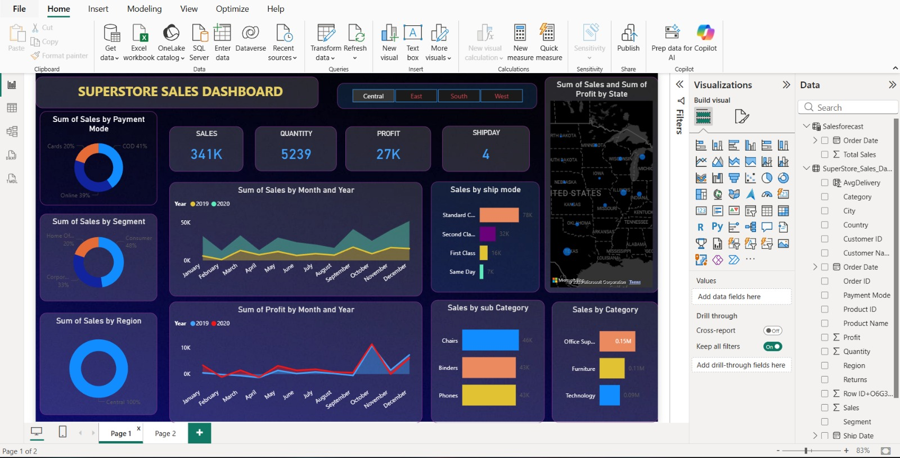
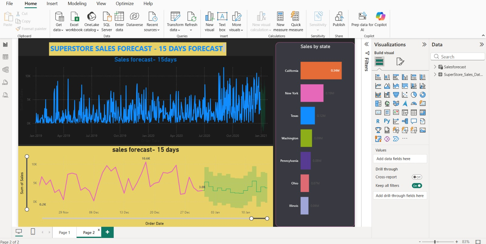

# superstore-sales-dashboard
Power BI dashboard for Superstore sales analysis and 15-day sales forecasting.

# 📊 Superstore Sales Dashboard (Power BI Project)

This project is an interactive **Sales Analytics Dashboard** built using Power BI.  
It analyzes sales performance, profit trends, and customer segments using the Superstore dataset.

The dashboard helps businesses understand sales trends, shipping performance, and category-wise performance to support better decision making.

---

## 🚀 Project Objective

The main objective of this project is to analyze:

- Overall Sales Performance
- Profit Trends
- Category & Sub-Category Analysis
- Region-wise Sales Distribution
- Shipping Mode Performance
- Sales Forecasting for next 15 days

---

## 🛠 Tools & Technologies Used

- Power BI
- Excel / CSV Dataset
- Data Visualization
- Data Cleaning
- Forecasting (Time Series)

---

## 📊 Dashboard Features

 1️⃣ KPI Cards
- Total Sales
- Total Profit
- Total Quantity
- Average Ship Days

 2️⃣ Sales Analysis
- Sales by Category
- Sales by Sub-Category
- Sales by Segment

3️⃣ Regional Analysis
- Sales by Region
- State-wise Sales Map

4️⃣ Shipping Analysis
- Sales by Ship Mode

 5️⃣ Time Analysis
- Monthly Sales Trend
- Monthly Profit Trend

 6️⃣ Forecasting
- 15 Days Sales Forecast using Power BI forecasting

---

## 📸 Dashboard Preview

### Sales Dashboard

### Sales Forecast

## 📈 Key Insights

- Technology category generated the highest revenue.
- Standard shipping mode is used the most.
- Consumer segment contributes the highest sales.
- Sales show seasonal trends across months.
- Forecasting predicts expected sales for the next 15 days.

---

## 👨‍💻 Author

**Alok kumar Mishra**

iamalokkumarmishra@hotmail.com

⭐ If you like this project, feel free to give it a star!
